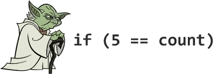

# Conditionals

Conditional bodies should always use braces even when a conditional body could be written without braces (e.g., it is one line only) to prevent errors. These errors include adding a second line and expecting it to be part of the if-statement. Another, even more dangerous defect, may happen where the line "inside" the if-statement is commented out, and the next line unwittingly becomes part of the if-statement.

**Preferred:**

```objective-c
if (!error) {
    return success;
}
```

**Not preferred:**

```objective-c
if (!error)
    return success;
```

or

```objective-c
if (!error) return success;
```

In February 2014 the well-know [goto fail](https://gotofail.com/) was found in the Apple's SSL/TLS implementation. 
The bug was due to a repeated `goto` statement after an `if` condition, wrapping the `if` branch in parentheses would have prevented the issue.

The code extract:

```objective-c
static OSStatus
SSLVerifySignedServerKeyExchange(SSLContext *ctx, bool isRsa, SSLBuffer signedParams,
                                 uint8_t *signature, UInt16 signatureLen)
{
  OSStatus        err;
  ...

  if ((err = SSLHashSHA1.update(&hashCtx, &serverRandom)) != 0)
    goto fail;
  if ((err = SSLHashSHA1.update(&hashCtx, &signedParams)) != 0)
    goto fail;
    goto fail;
  if ((err = SSLHashSHA1.final(&hashCtx, &hashOut)) != 0)
    goto fail;
  ...

fail:
  SSLFreeBuffer(&signedHashes);
  SSLFreeBuffer(&hashCtx);
  return err;
}
```

Easy to spot, there are 2 `goto fail;` lines one after the other without parentheses. We definitely don't want to risk creating bugs like the one above right?

In addition, this style is more consistent with all other conditionals, and therefore more easily scannable.


## Yoda conditions

Always avoid Yoda conditions. A Yoda condition is when comparing a constant to a variable instead of the other way around. It's like saying "if blue is the sky" or "if tall is the man" instead of "if the sky is blue" or "if the man is tall".



**Preferred:**
```objective-c
if ([myValue isEqual:@42]) { ...
```

**Not preferred:**
```objective-c
if ([@42 isEqual:myValue]) { ...
```

## nil and BOOL checks

On a similar note of the Yoda conditions, also the nil check has been at the centre of debates. Some notous libraries out there use to check for an object to be or not to be nil as so:

```objective-c
if (nil == myValue) { ...
```

One could argue that this is amiss or similar to a Yoda condition as nil is kind of a constant. The reason why sometimes programmers use this approach to prevent error that are difficult to debug. Consider the following code:

```objective-c
if (myValue == nil) { ...
```

If a typo occurs and the programmer actually types:

```objective-c
if (myValue = nil) { ...
```

it would be a valid assignment, indeed hard to debug if you are an experienced programmer (and therefore probably with some kind of visual impairment). That could never occur putting `nil` as argument on the left as it is nor assignable. There is also to be said that if the programmer uses this approach, he or she is perfectly aware of the underlying motivation and therefore the whole thing decades as it would be better to just double check what just typed.

More on this, to avoid all this fuss the approach that leave no space to doubt is to use the exclamation mark. Since `nil` resolves to `NO` it is unnecessary to compare it in conditions. Also, never compare something directly to `YES`, because `YES` is defined to 1 and a `BOOL` can be up to 8 bits as it is a char underneath.

**Preferred:**
```objective-c
if (someObject) { ...
if (![someObject boolValue]) { ...
if (!someObject) { ...
```

**Not Preferred:**
```objective-c
if (someObject == YES) { ... // Wrong
if (myRawValue == YES) { ... // Never do this.
if ([someObject boolValue] == NO) { ...
```

This allows also for more consistency across files and greater visual clarity.

## Golden Path

When coding with conditionals, the left hand margin of the code should be the "golden" or "happy" path.  That is, don't nest `if` statements.  Multiple return statements are OK. This will avoid the growth of cyclomatic complexity and make the code easier to read because the important part of your method is not nested inside a branch but you have a visual clue of what is the most relevant code. 

**Preferred:**

```objective-c
- (void)someMethod {
  if (![someOther boolValue]) {
      return;
  }

  //Do something important
}
```

**Not preferred:**

```objective-c
- (void)someMethod {
  if ([someOther boolValue]) {
    //Do something important
  }
}
```
## Complex Conditions

When you have complex condition in the `if` clause you should always extract them and assign to a `BOOL` variable to make more clear the logic and the meaning of every single conditions.

```objective-c
BOOL nameContainsSwift  = [sessionName containsString:@"Swift"];
BOOL isCurrentYear      = [sessionDateCompontents year] == 2014;
BOOL isSwiftSession     = nameContainsSwift && isCurrentYear;

if (isSwiftSession) {
    // Do something very cool
}
```

## Ternary Operator

The Ternary operator, `?` , should only be used when it increases clarity or code neatness. A single condition is usually all that should be evaluated. Evaluating multiple conditions is usually more understandable as an if statement, or refactored into instance variables.

**Preferred:**
```objective-c
result = a > b ? x : y;
```

**Not preferred:**
```objective-c
result = a > b ? x = c > d ? c : d : y;
```

When the second argument of the ternary operator (the if branch) returns the same object that was checked for existence in the condition, the following syntax is neat:

**Preferred:**
```objective-c
result = object ? : [self createObject];
```

**Not preferred:**
```objective-c
result = object ? object : [self createObject];
```

## Error handling

When methods return an error parameter by reference, check the returned value, not the error variable.

**Preferred:**
```objective-c
NSError *error = nil;
if (![self trySomethingWithError:&error]) {
    // Handle Error
}
```

Moreover, some of Apple's APIs write garbage values to the error parameter (if non-NULL) in successful cases, so checking the error can cause false negatives (and subsequently crash).

